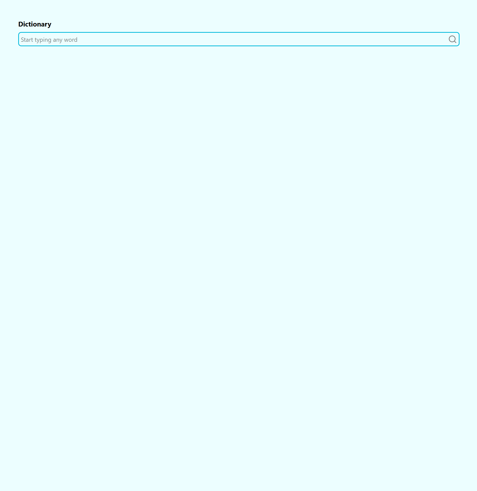

# dictionary-web-app
Dictionary web app. 

This README contains screenshots of the app, information on how to run the app locally and improvements to implement. 

## Screenshots of the app
Search Bar: 


Results for searching for 'hockey': 


Longer results generated from searching for 'dog':


## How to run locally
1. Open app folder using ```cd app```
2. run ```npm install```
3. Once dependencies have installed, run ```npm run dev```
4. The application should be served on http://localhost:5173/ , but check the terminal. 

## Improvements to implement
- Improve handling of missing information returned from the api, such as informing the user that the information is missing, while still displaying the information that has been found.  
- Improve user experience if word has been not found by implementing a message that is display instead of the results. Including empty search is handled. 
 
